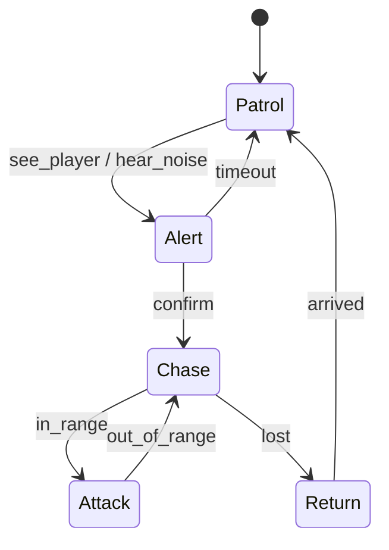
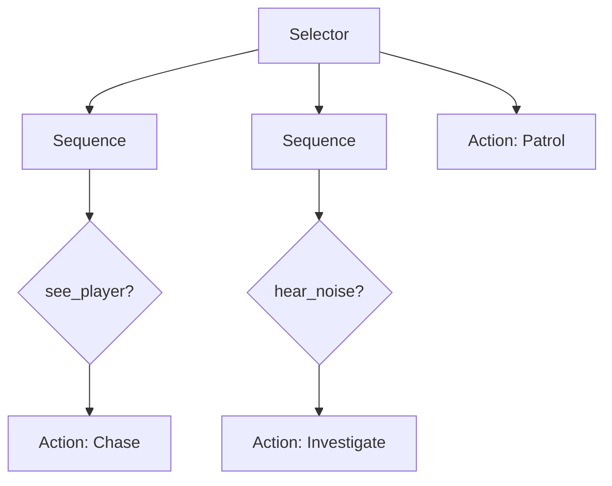

# Диаграммы (вставьте в отчёт)

## FSM

```mermaid
stateDiagram-v2
    [*] --> Patrol
    Patrol --> Alert: see_player / hear_noise
    Alert --> Chase: confirm
    Alert --> Patrol: timeout
    Chase --> Attack: in_range
    Attack --> Chase: out_of_range
    Chase --> Return: lost
    Return --> Patrol: arrived
```

## Behavior Tree

```mermaid
flowchart TD
    R[Selector] --> S1[Sequence]
    R --> S2[Sequence]
    R --> P[Action: Patrol]
    S1 --> C1{see_player?} --> A1[Action: Chase]
    S2 --> C2{hear_noise?} --> A2[Action: Investigate]
```
